# Wetcon OPC UA Client 2 AWS IoT console application

This console application demonstrates how to read device parameter values from the PACTware OPC UA Server Plugin using a OPC UA Client and how to store current state information for the device via [Device Shadow RESTful API](https://docs.aws.amazon.com/iot/latest/developerguide/iot-device-shadows.html).

## Getting Started


**Sign into AWS IoT console**

* Sign in to the [AWS IoT console](https://console.aws.amazon.com/iot/home), and on the Welcome page, choose **Get started**, if you are using the AWS IoT console for the first time.

**Create a policy**

* Go to **Secure** | **Policies** and click on **Create a policy**.
  
  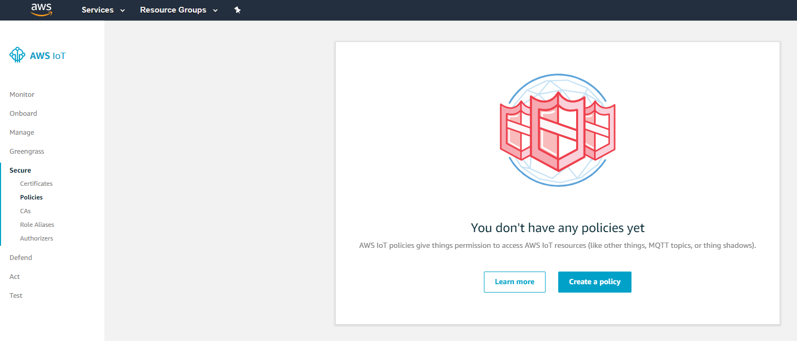 

* In the following dialog give the policy any name, choose `iot:*` as Policy statement action and `*` as Resource ARN and select the *Allow* check box. Click on **Create** to create the policy.

  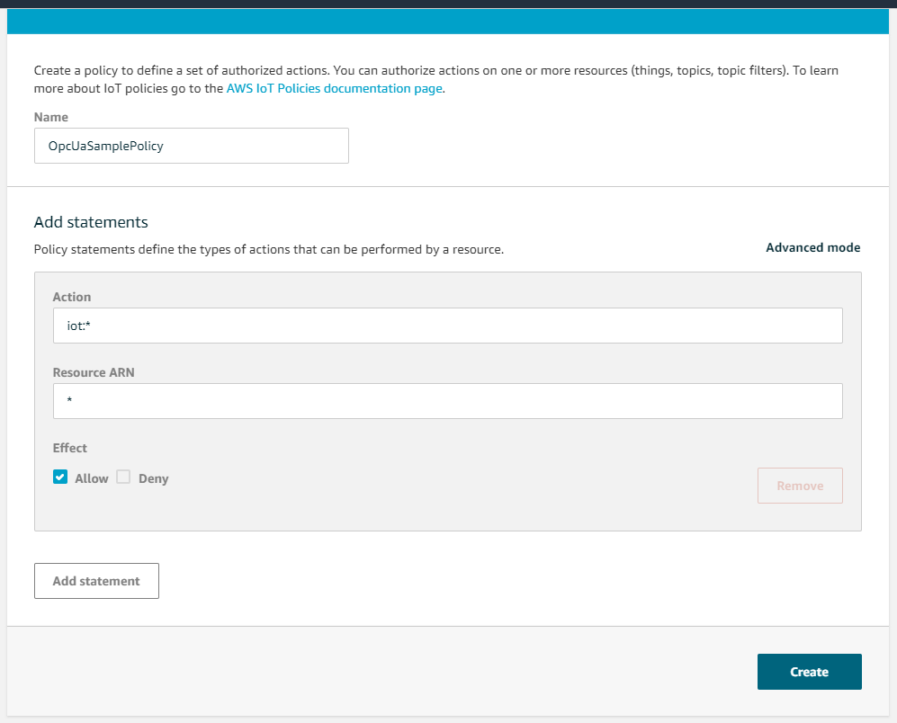 

**Add a thing**

* Next navigate to **Manage** | **Things** and click on **Register a thing** in order to register a new device ("thing").
 
  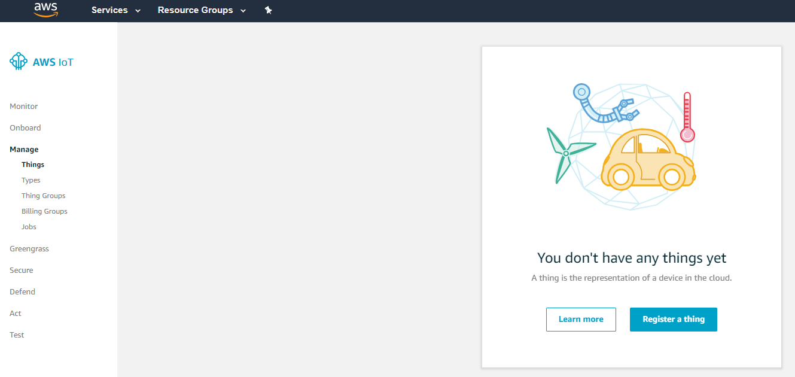 

* Click on **Create a single thing**.

  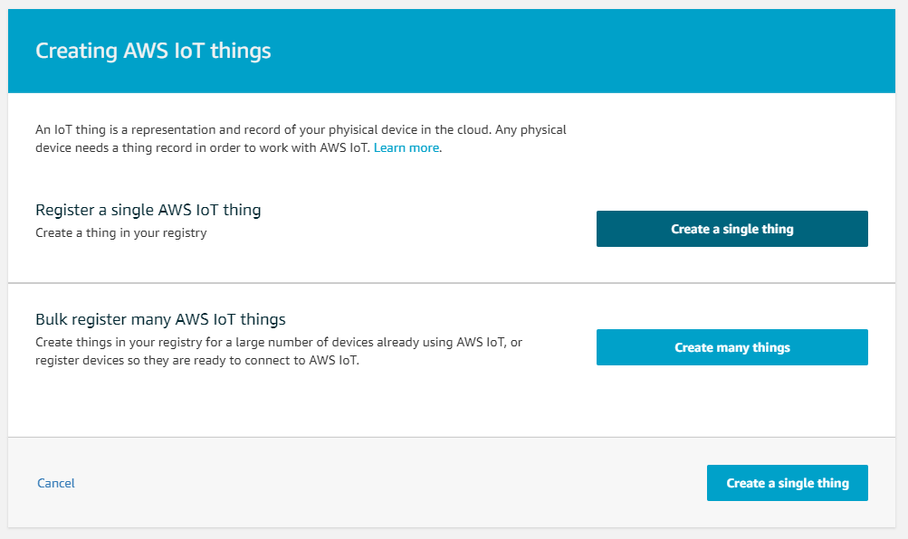

* Give it any valid name, keep the other default settings and choose **Next**.

  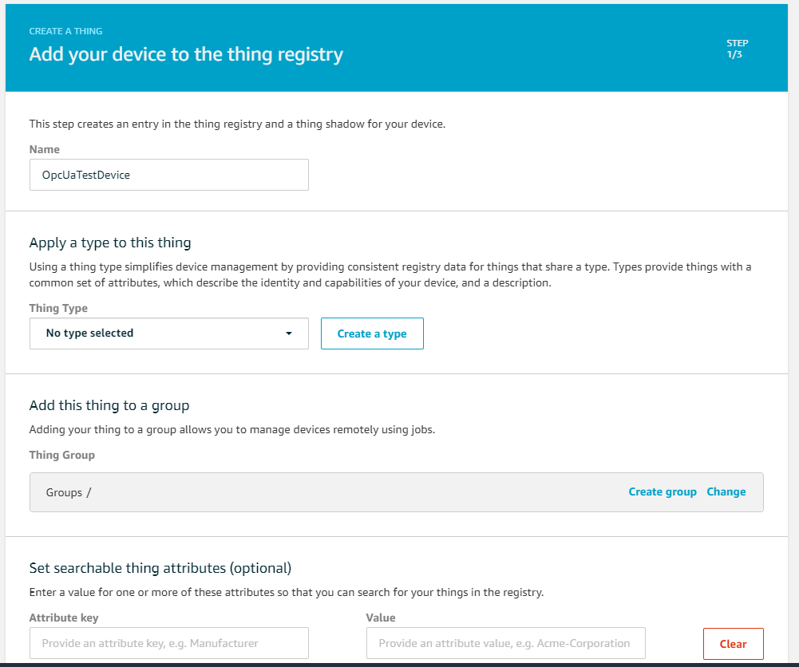

* Select the recommended One-click certificate creation

  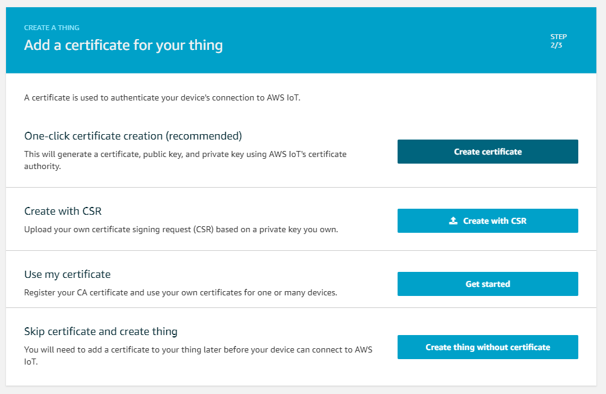 

* Download and save the certificate, private and public key if you want to connect using it later.

  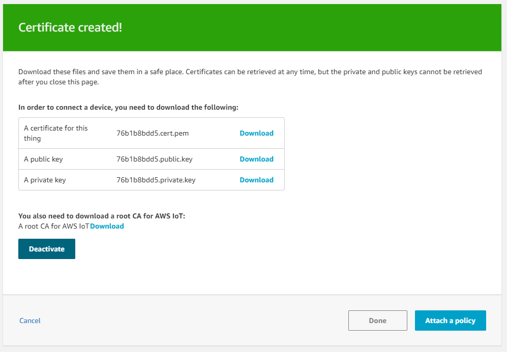 

* In the last dialog step, select the policy you created earlier and click **Register Thing**.

  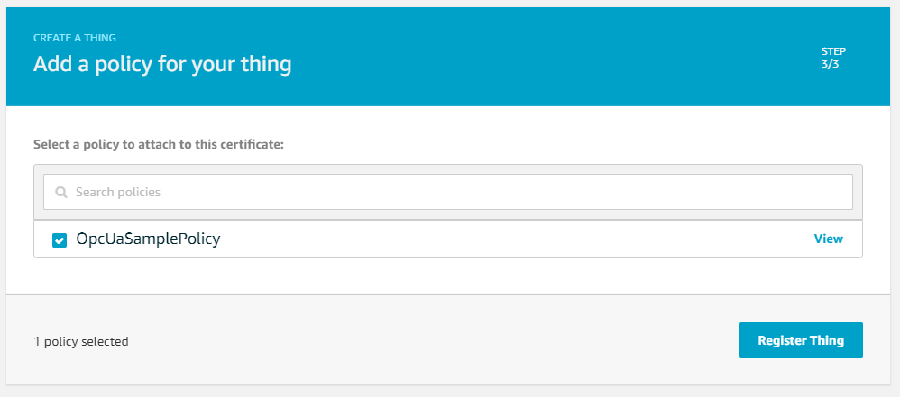 

**Get connection credentials**

* In order to connect to AWS IoT, we will need our custom *endpoint url* which can be accessed under **Settings**
  
  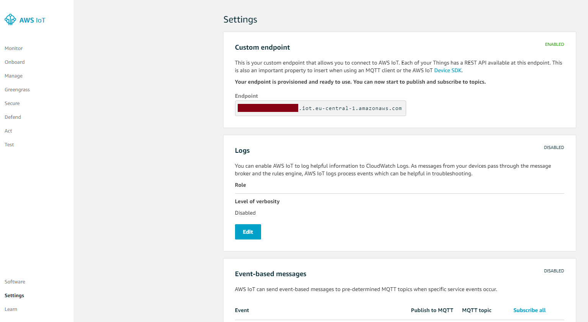    

* The authentication method used in this sample is *Signature Version 4 with IAM credentials*. You can also use the certificate you created earlier as authentication method. In order to get the IAM credentials, click on your account name in the upper right and then on **My Security Credentials**.
  
  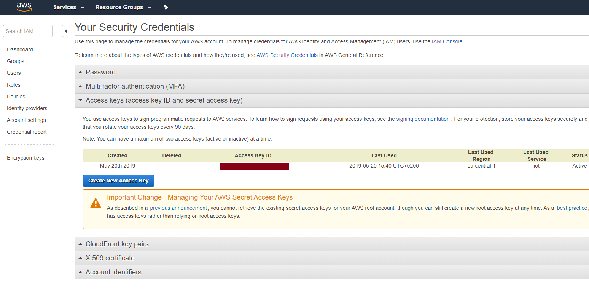   

* Here you can create a new access key by clicking on **Create New Access Key**.
 
  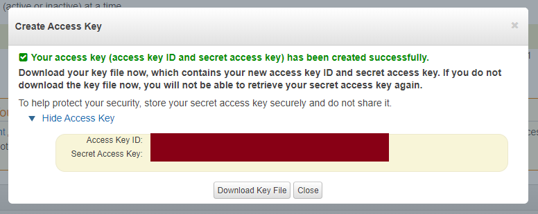  

  Store the *Access Key Id* and *Secret Access Key* for later.

## Usage

**Setup and start the console application**

* To start the console application, it needs to be provided with four command line parameters:
  
  1. Device Node Id to read device properties and parameters from
  2. OpcUa Server Url 
  3. Name of the device parameter to be read
  4. Name of the parameter when uploaded (use "Setting1" if you follow this guide)
  5. AWS Access Key Id
  6. AWS Secret Access Key
  7. Endpoint Url (add `https://`)
  8. The name of the thing you created earlier ("OpcUaTestDevice" if you entered the name from the screenshot)
  
  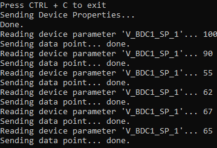  

* Upon startup it reads the manufacturer, model and serial number from the OPC UA Server and sends them to AWS IoT.
* It will then periodically read the given device parameter and send the value as well.

  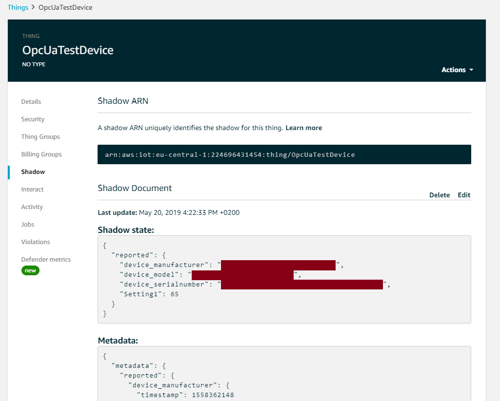    

## Visualizing the device data

You can use AWS to further visualize or process the incoming device parameters. AWS IoT Analytics provides functionality to analyze, visualize IoT data or apply it in machine learning use cases.
Here we quickly outline how to visualize the device data that is sent periodically within this console application with IoT Analytics Jupyter notebooks. Another possibility is to visualize the data with AWS QuickSight.
* Create a channel, pipeline datastore and dataset in AWS IoT Analytics
* Add a rule to AWS IoT which sends the reported device shadow data to the IoT Analytics channel
  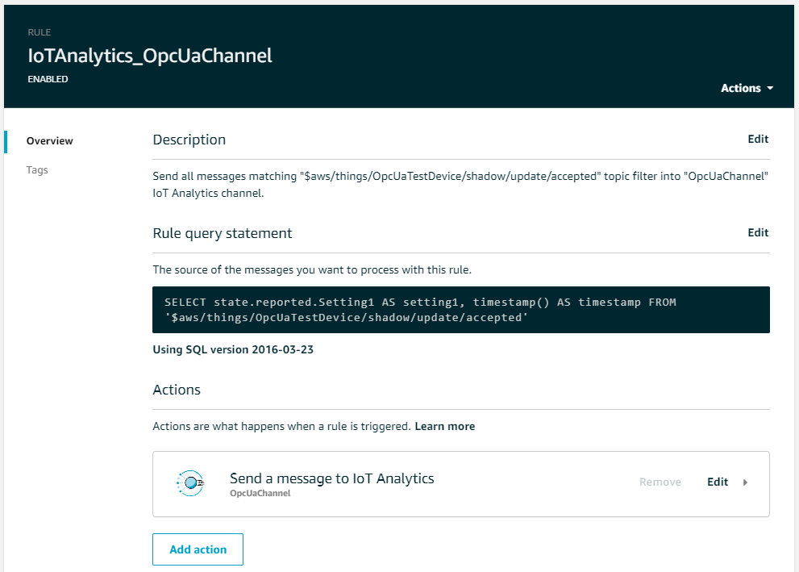  
  ``SELECT state.reported.Setting1 AS setting1, timestamp() AS timestamp FROM '$aws/things/OpcUaTestDevice/shadow/update/accepted'``
* Let the console application send some values
* Depending on whether you setup a schedule on the IoT Analytics dataset, make it run manually:
  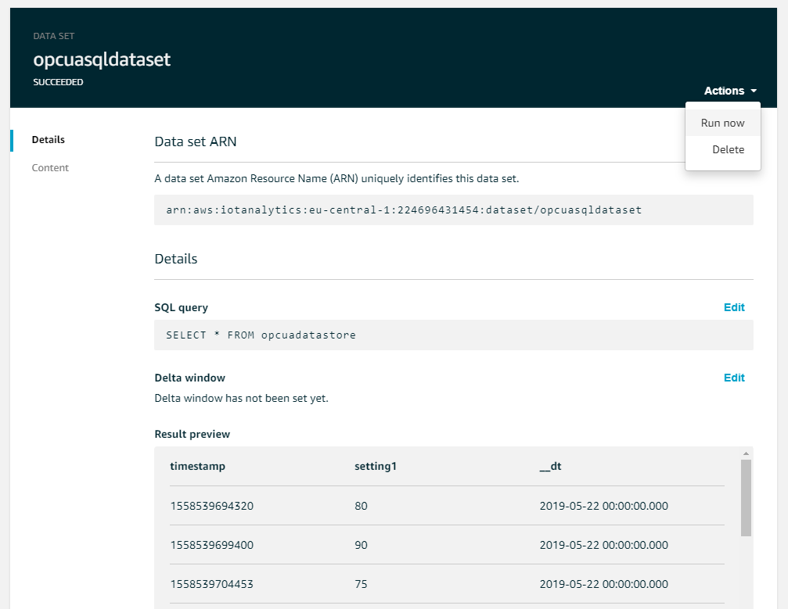  
* Create a blank notebook in IoT analytics and use the following Python code
  ```python
  import boto3
  import pandas as pd
  import matplotlib.pyplot as plt
  import datetime
  
  client = boto3.client('iotanalytics')
  dataset = "opcuasqldataset"
  time_col = 'timestamp'
  value_col = 'setting1' 
  dataset_url = client.get_dataset_content(datasetName = dataset)['entries'][0]['dataURI']
  
  data = pd.DataFrame()
  df = pd.read_csv(dataset_url, chunksize=1000)
  
  for chunk in df:
      chunk.dropna(axis=0, inplace=True) # Dropping all rows with any NaN setting1 value  
      chunk[time_col] = pd.to_datetime(chunk[time_col]*1e6).dt.floor('S') # convert timestamp, omit milliseconds for plot
      data = data.append(chunk)
      
  del df, chunk
  
  data.set_index(time_col,inplace=True)
  data = data.sort_index()
  data.plot(kind='bar')
  ```
  to create a plot like this:
  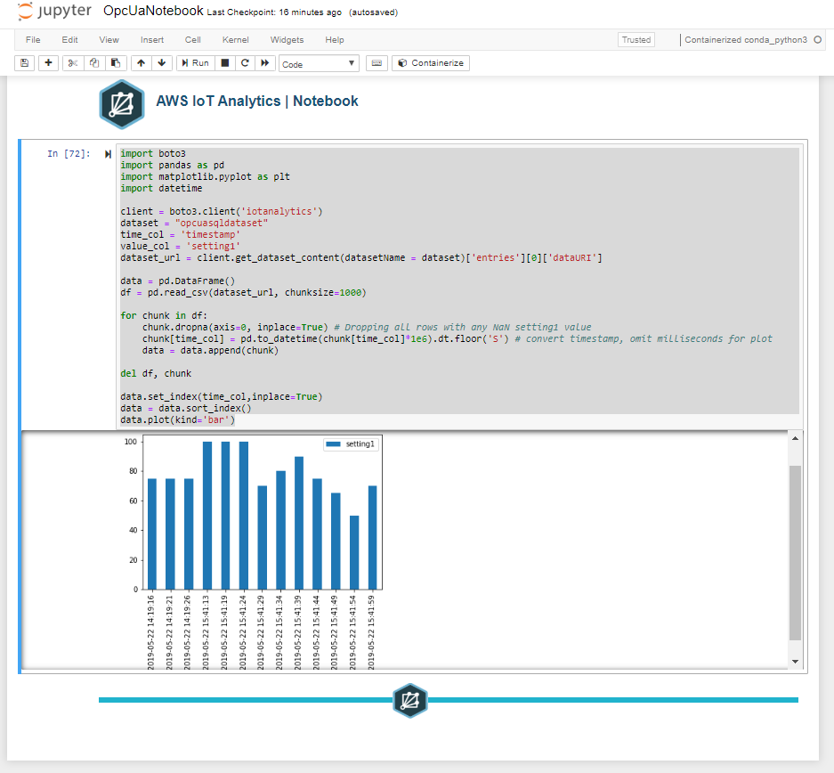

See [this guide](https://d1.awsstatic.com/IoT/User%20Guide%20PDFs/04_AWS_Mini-User_Guide_Analytics-and-Visualization_August2018.pdf) for a more complete description of the AWS IoT visualization capabilities.

## License & Dependencies

Copyright (c) 2019 wetcon gmbh. All rights reserved.

Wetcon provides this source code under a dual license model designed to meet the development and distribution needs of both commercial distributors (such as OEMs, ISVs and VARs) and open source projects.

For open source projects the source code in this file is covered under GPL V2. See https://www.gnu.org/licenses/old-licenses/gpl-2.0.en.html

OEMs (Original Equipment Manufacturers), ISVs (Independent Software Vendors), VARs (Value Added Resellers) and other distributors that combine and distribute commercially licensed software with this source code and do not wish to distribute the source code for the commercially licensed software under version 2 of the GNU General Public License (the "GPL") must enter into a commercial license agreement with wetcon.

This source code is distributed in the hope that it will be useful, but WITHOUT ANY WARRANTY; without even the implied warranty of MERCHANTABILITY or FITNESS FOR A PARTICULAR PURPOSE.

Wetcon OPC UA Client 2 AWS IoT console application uses the official [OPC UA .Net Standard Stack](https://github.com/OPCFoundation/UA-.NETStandard) released under GPL V2.


