# Wetcon OPC UA Client 2 Azure IoT console application

This console application demonstrates how to read device parameter values from the PACTware OPC UA Server Plugin using a OPC UA Client and how to send the values as telemetry measurements to Azure IoT Central.

## Getting Started

**Provision your Azure IoT Central trial application**

* Navigate to the [Azure IoT Central Application Manager](https://apps.azureiotcentral.com) page, login and click **New Application**
  
  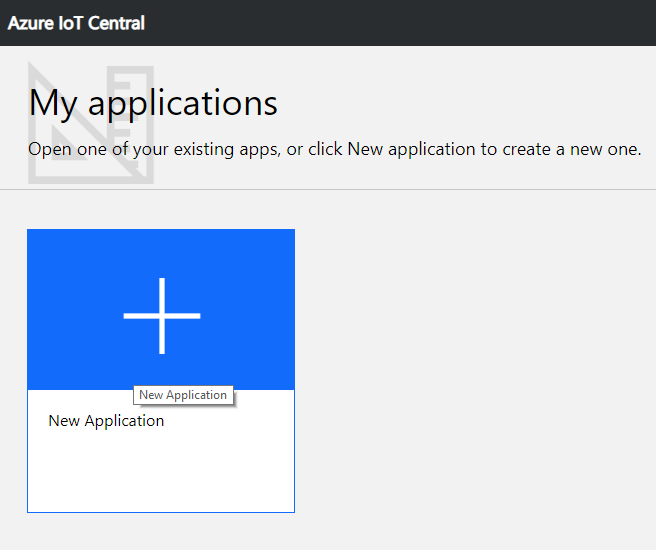 

* On the next page, chose payment plan **Trial** and application template **Custom application**
 
  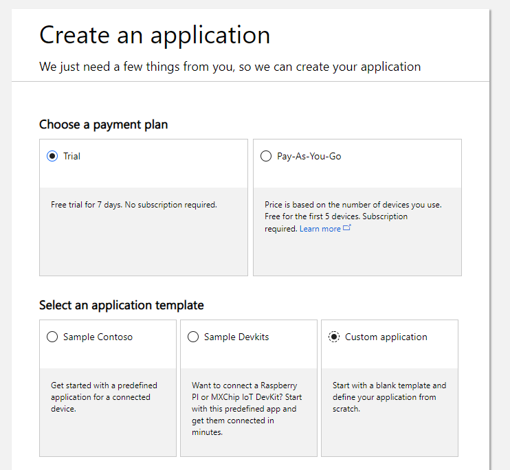 

* Set or keep default application name and URL, enter your contact info and press **Create** in order to provison your application

**Add a new device**

* After provisioning your application you are redirected to the dashboard automatically. Select **Create Device Templates**
  
  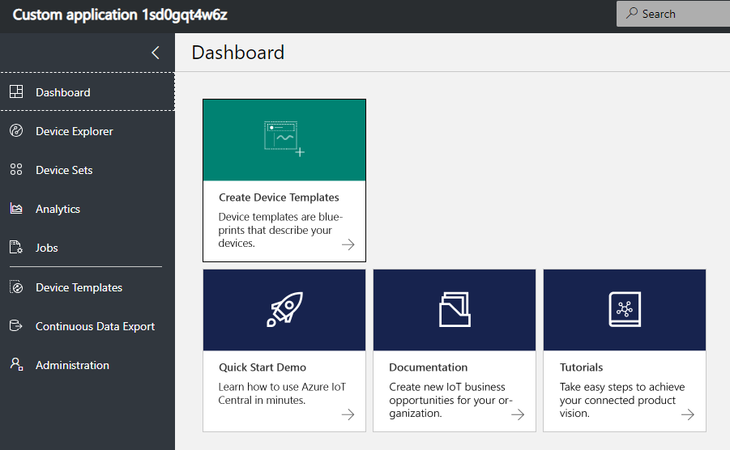    

* Add a name for your Device Template and press **Create**
  
  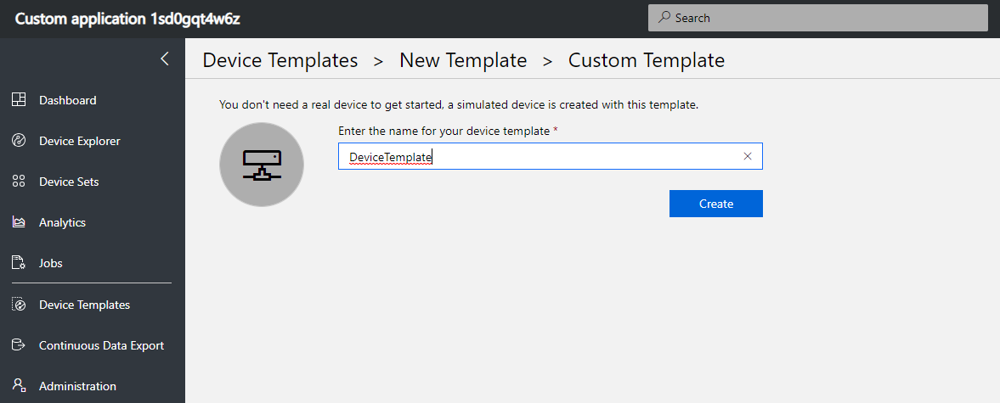   

* Add a new Telemetry Measurement by clicking on **+ New Measurement** | **Telemetry**, enter *Setting1* as display and field name and press **Save**
 
  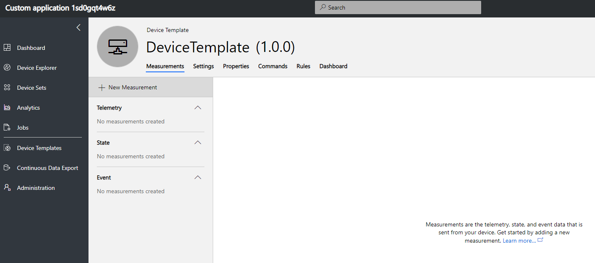   

  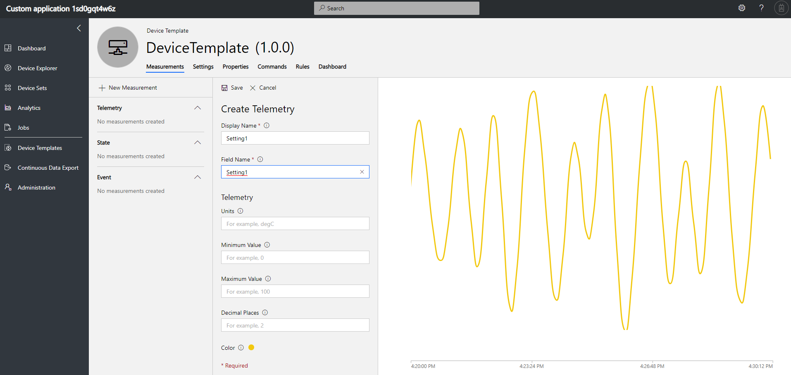  

* Add three Device Properties

  - Display Name: **Device Manufacturer** (Field Name: `device_manufacturer`)
  - Display Name: **Device Model** (Field Name: `device_model`)
  - Display Name: **Serial Number** (Field Name: `device_serialnumber`)
  
  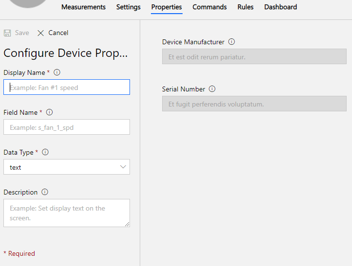  

* Go to the *Device Explorer* in the navigation menu and press **+** | **Real** to add a new real device. Set the Device ID and Name and click **Create**
  
  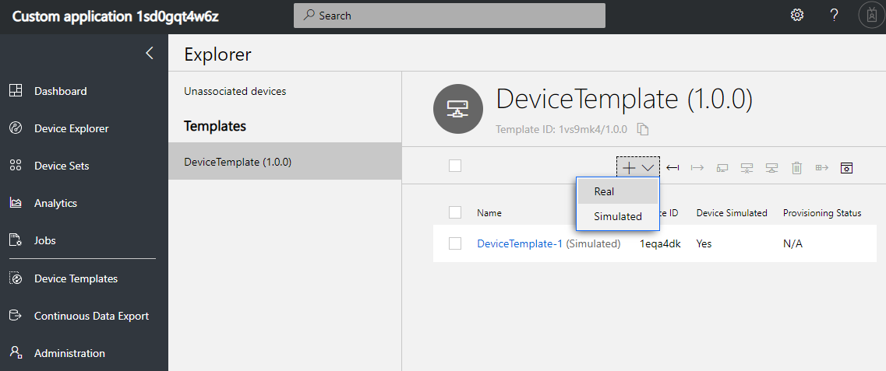  

**Get the connection string**

* Make sure you have [Node JS](https://nodejs.org) version 8.0.0 or later installed
* Install the [key generator utility](https://github.com/Azure/dps-keygen) by running the command `npm i -g dps-keygen` 
* In your Azure IoT Central Application Manager, select your real device in the *Device Explorer*. Press **Connect** in the upper right to get the Device Connection information. We will use this information in the next step to create the connection string.
  
  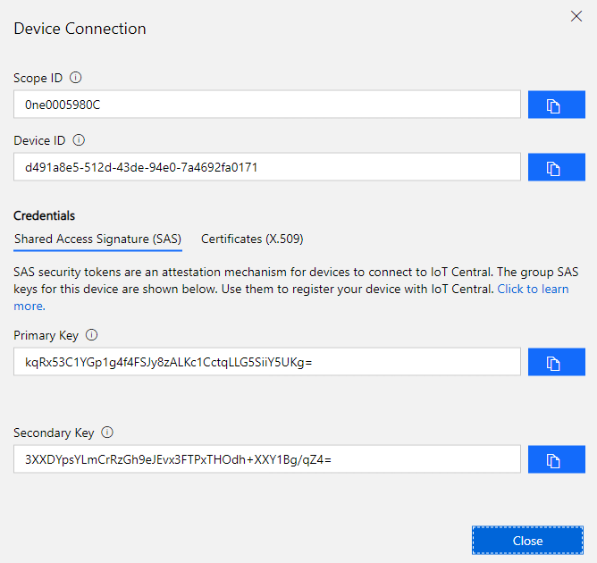  

* Generate the connection string by running the command `dps-keygen -di:<Device ID> -dk:<Primary or Secondary Key> -si:<Scope ID>`
 
  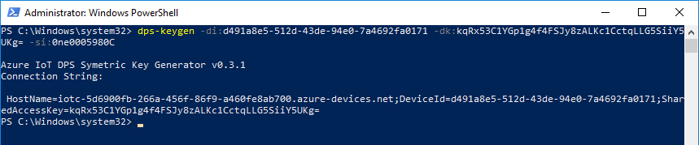  

* Copy the result and store it for later usage

## Usage

**Setup and start the console application**

* To start the console application, it needs to be provided with four command line parameters:
  
  1. Device Node Id to read device properties and parameters from
  2. OpcUa Server Url
  3. Name of the device parameter to be read
  4. Name of the parameter when uploaded (use "Setting1" if you follow this guide)
  5. Device connection string you got earlier
  
  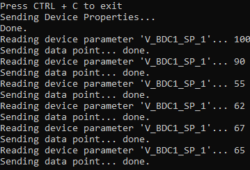  

* Upon startup it reads the manufacturer, model and serial number from the OPC UA Server and sends them to Azure IoT.
* It will then periodically read the given device parameter and send the value as well.

  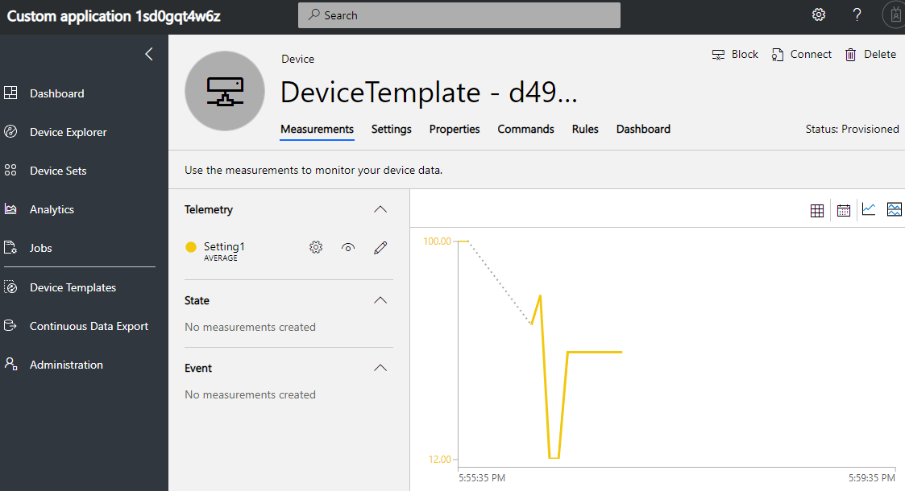  

  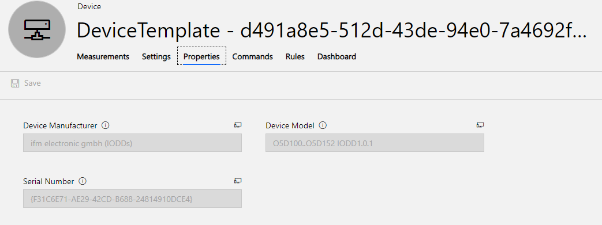  

## License & Dependencies

Copyright (c) 2019 wetcon gmbh. All rights reserved.

Wetcon provides this source code under a dual license model designed to meet the development and distribution needs of both commercial distributors (such as OEMs, ISVs and VARs) and open source projects.

For open source projects the source code in this file is covered under GPL V2. See https://www.gnu.org/licenses/old-licenses/gpl-2.0.en.html

OEMs (Original Equipment Manufacturers), ISVs (Independent Software Vendors), VARs (Value Added Resellers) and other distributors that combine and distribute commercially licensed software with this source code and do not wish to distribute the source code for the commercially licensed software under version 2 of the GNU General Public License (the "GPL") must enter into a commercial license agreement with wetcon.

This source code is distributed in the hope that it will be useful, but WITHOUT ANY WARRANTY; without even the implied warranty of MERCHANTABILITY or FITNESS FOR A PARTICULAR PURPOSE.

Wetcon OPC UA Client 2 Azure IoT console application uses the official [OPC UA .Net Standard Stack](https://github.com/OPCFoundation/UA-.NETStandard) released under GPL V2.

