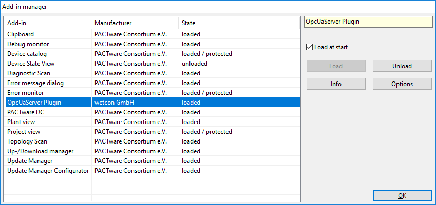
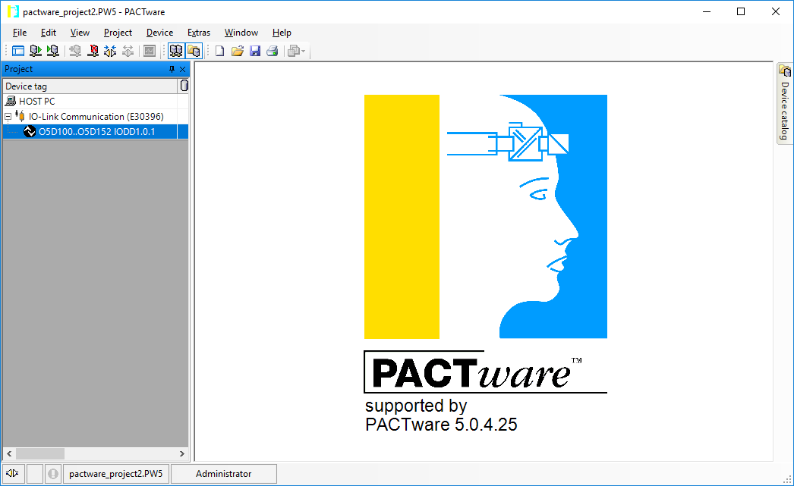
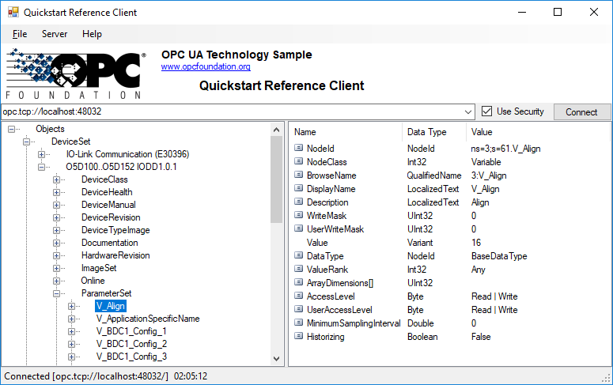
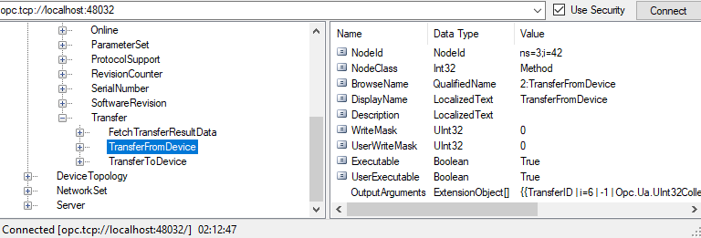

# Wetcon OPC UA Server PACTware Plugin

This repository contains the OPC UA Server PACTware Plugin for [PACTware 5.0](https://pactware.com/). 

**Features**
* It implements the OPC UA [Device Integration](https://opcfoundation.org/developer-tools/specifications-unified-architecture/part-100-device-information-model/) (DI) information model
* Retrieves, reads and writes specific device Offline Parameters using *DtmSingleInstanceDataAccess* and *DtmParameter* interfaces
* Retrieves, reads and writes Online Parameters using *DtmSingleDeviceDataAccess* interface
* The transfer of Parameters between offline nodes and the physical device is supported by exposing a *TransferServicesType* providing appropriate methods
* As not all DTMs expose process data via these interfaces, IO Link process parameters are exemplary read using a FdtCommunication.TransactionRequest

## Getting Started

**Installer**

An installer for this plugin can be conveniently downloaded from the [wetcon website](https://www.wetcon.net/fdi-fdt-pactware-opc-ua/) if you don't want to build from source. Download and execute the installer, and follow its instructions to install the plugin.

**Debug / build from source**

* Open and build the Solution in Debug release configuration with Visual Studio.
* Run `src\Wetcon.PactwarePlugin.OpcUaServer.Plugin\Wetcon.PactwarePlugin.OpcUaServer_x64.bat` to install the debug build in PACTware.

After the next start of PACTware, you should be able to see the already loaded plugin in the  **Add-in Manager** *(Main Menu | Extras | Add-ins)*.

## Configuration (optional)

**Change OPC Server Uri using plugin UI**

Select the plugin in the Add-in manager list and press the **Options** button on the right in order to setup the the OPC UA Server Uri. The default Uri is `opc.tcp://localhost:48032`. You can edit the url in the corresponding text field and press **Ok**. Restart PACTware for this change to take effect.

**Configure additional OPC UA settings and security in the configuration file**

You can edit more OPC UA settings like security, transport quotas and server configurations by locating and editing the `WetconOpcUaServer.Config.xml` file. You can find it in the installation directory or in the `bin/debug` folder of the project if you built the plugin from source. 

**Location of certificates**

Each OPC UA application installation must have an application instance certificate which identifies the application and the machine the application is running on.

By default, the plugin uses a certificate directory store located at `${APPDATA}\wetcon\PACTwarePlugins\OpcUaServer\Certificates\own\`. The _certs_ subdirectory is intended to contain the certificates whereas the _private_ subdirectory contains the private keys. If you want to use your own certificate, make sure to copy the public and private key to the appropriate folders of the certificate directory store and adapt the `WetconOpcUaServer.Config.xml` file accordingly. If the plugin is started for the first time (and no own certificate was provided by an administrator), it will create its own certificate and save it to the directory store.

Trusted (client) certificates are kept in this location: `${APPDATA}\wetcon\PACTwarePlugins\OpcUaServer\Certificates\trusted\certs\`.

It is also possible to use a windows certificate store instead of the directory store.

A convenient tool to administer the application configuration and certificates is the [UA Configuration Tool](http://opcfoundation.github.io/UA-.NETStandard/help/ua_configuration_tool.htm).

**Local Discovery Server**

If you want to enable registering with a Local Discovery Server (LDS), set the value of `<MaxRegistrationInterval>` in the configuration file to a value greater than zero.

## Usage

Start PACTware and open a project with devices.

The plugin automatically starts the OPC UA Server in the background which can be connected to with a OPC UA Client. In the screenshot below, we use the official [OPC UA .Net Standard Reference Client Sample](https://github.com/OPCFoundation/UA-.NETStandard).

The devices are listed under the DeviseSet node. Select a device to get, read or write its online and offline parameters. Also the offline device exposes a *Transfer* node (being a type of *TransferServicesType*) implementing the methods

* _TransferFromDevice_
* _TransferToDevice_
* _FetchTransferResultData_

that can be consumed by the client. The _FetchTransferResultData_ can only be called after a _TransferFromDevice_ or _TransferToDevice_ invocation using the returned _TransferId_ output parameter.

A log file can be found at `${APPDATA}\wetcon\PACTwarePlugins\OpcUaServer\Logs\OpcUaServerPlugin.log`.

## License & Dependencies

Copyright (c) 2019 wetcon gmbh. All rights reserved.

Wetcon provides this source code under a dual license model designed to meet the development and distribution needs of both commercial distributors (such as OEMs, ISVs and VARs) and open source projects.

For open source projects the source code in this file is covered under GPL V2. See https://www.gnu.org/licenses/old-licenses/gpl-2.0.en.html

OEMs (Original Equipment Manufacturers), ISVs (Independent Software Vendors), VARs (Value Added Resellers) and other distributors that combine and distribute commercially licensed software with this source code and do not wish to distribute the source code for the commercially licensed software under version 2 of the GNU General Public License (the "GPL") must enter into a commercial license agreement with wetcon.

This source code is distributed in the hope that it will be useful, but WITHOUT ANY WARRANTY; without even the implied warranty of MERCHANTABILITY or FITNESS FOR A PARTICULAR PURPOSE.

Wetcon OPC UA Server PACTware Plugin uses the official [OPC UA .Net Standard Stack](https://github.com/OPCFoundation/UA-.NETStandard) released under GPL V2.

